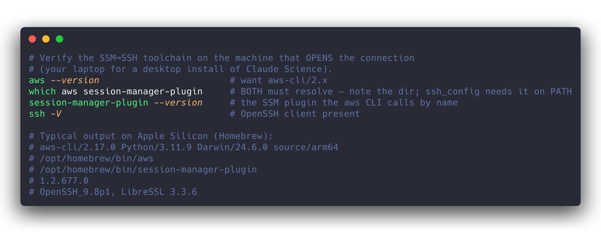
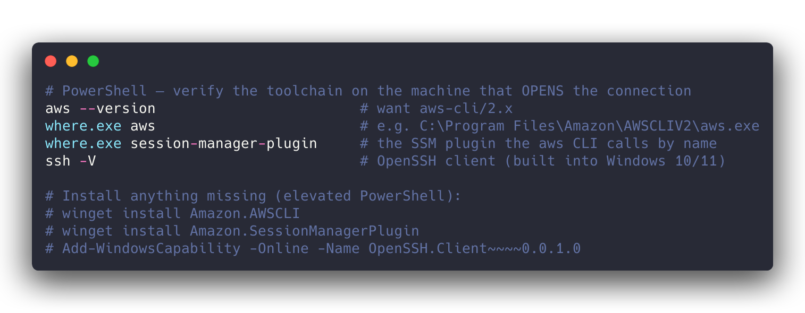
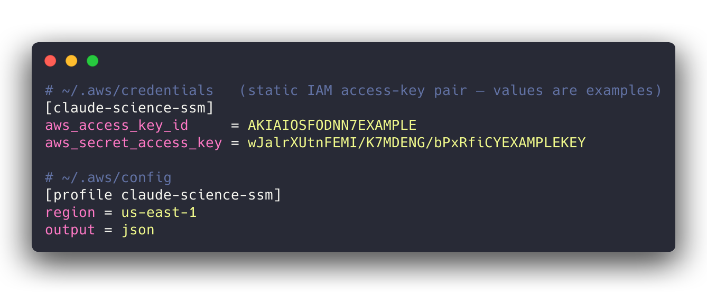
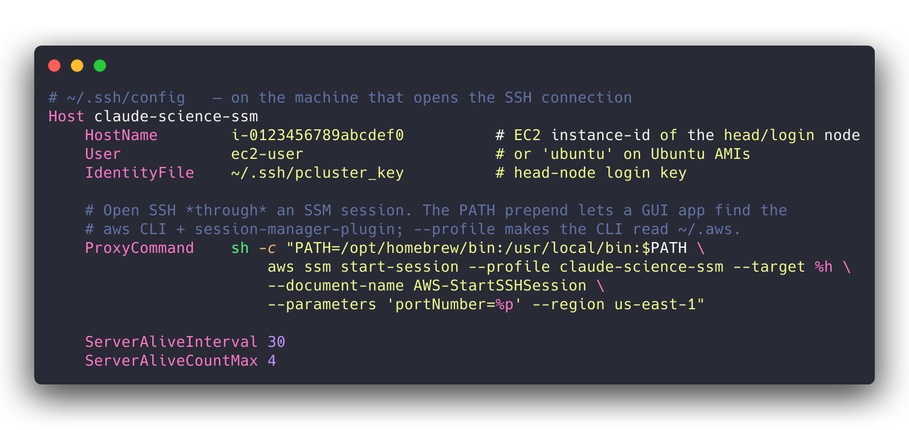
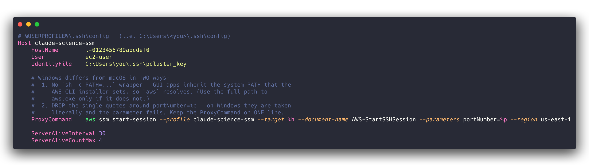
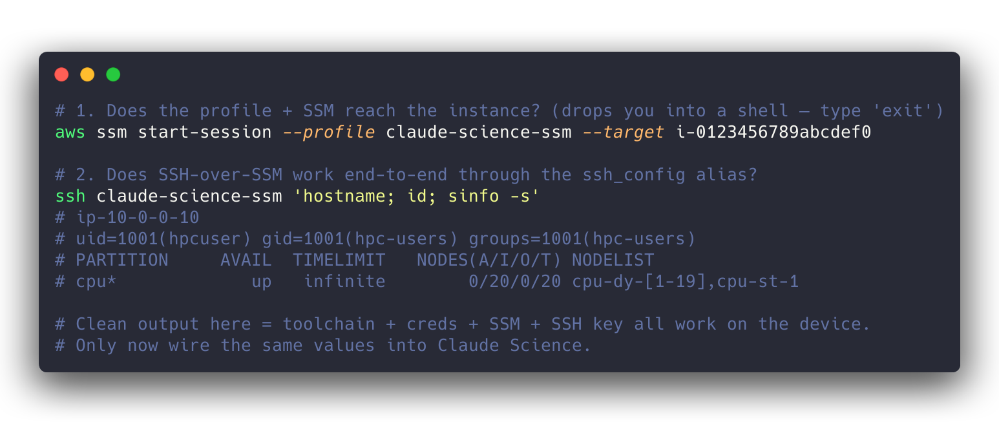
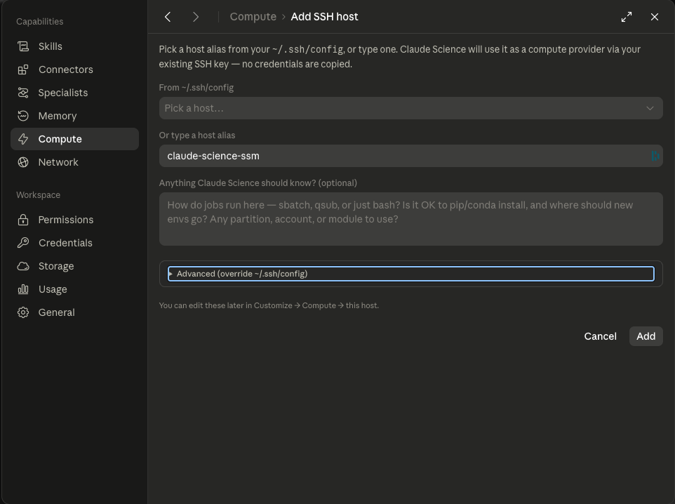
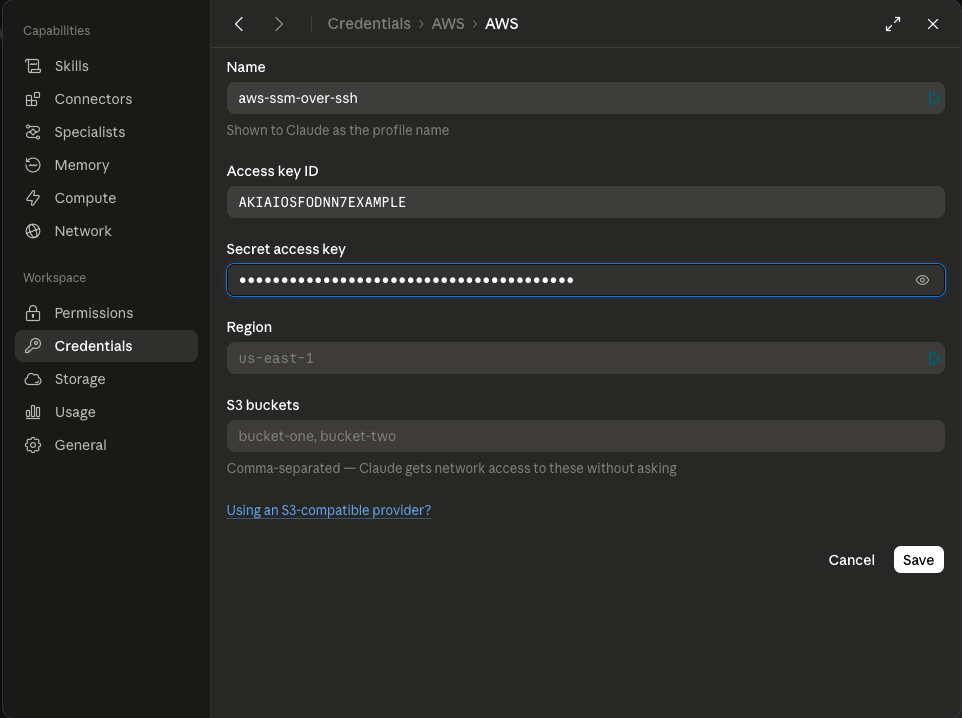
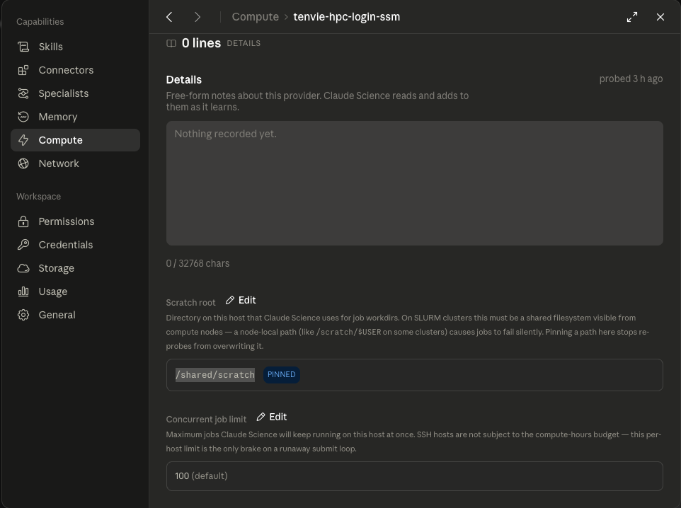

# Connecting Claude Science to AWS HPC (SSH over SSM)

A start-to-finish guide for wiring [Claude Science](https://claude.com/product/claude-science)
to an AWS HPC cluster — **AWS ParallelCluster** or **AWS PCS** — that lives in a
private subnet with no public IP. It covers what to set up **on your own device
first**, how to prove it works, and the three settings to configure in Claude
Science afterward. Instructions are given for **macOS and Windows**.

## Why this exists

Claude Science's native compute provider connects over **SSH**. It has no "SSM
transport." But a security-conscious AWS HPC cluster has **no public SSH endpoint**
— the head/login node sits in a private subnet inside a workload VPC, reachable
only through **AWS Systems Manager (SSM)**. Opening it up (a public IP, an inbound
`:22`, a bastion) is exactly what we're trying to avoid.

The fix is to **proxy SSH over an SSM session**: an `aws ssm start-session`
`ProxyCommand` in your `ssh_config` turns the SSM channel into an ordinary SSH
connection to the private node. No inbound ports, no public IP, no bastion — just
an IAM-scoped SSM session. Claude Science then submits and monitors jobs as if it
had SSH'd in directly, and only result files come back.


The rest of this guide sets that up. The model is simple: **make it work from
your own terminal first, then hand the exact same pieces to Claude Science.**

---

## Prerequisites — verify these on your device first

The `ProxyCommand` runs **wherever the SSH connection is opened**. For a desktop
install of Claude Science that is **your own machine**, so that machine needs:

- **AWS CLI v2**
- the **Session Manager plugin** (`session-manager-plugin`) — the AWS CLI calls it
  *by name*, so it must be on `PATH`
- an **OpenSSH client** (`ssh`)
- **AWS credentials** allowed to start an SSM session to the target instance
  (a least-privilege IAM user — see [`iam-user-for-ssm-sessions/`](iam-user-for-ssm-sessions/))

On the cluster side, the target EC2 instance must have the **SSM Agent running**
and an **instance role that allows Session Manager** (true for PCS login nodes by
default, and for any instance you can already reach with `aws ssm start-session`).

### macOS



Install anything missing with Homebrew:

```bash
brew install awscli session-manager-plugin
```

Note the directory that `which aws session-manager-plugin` prints
(`/opt/homebrew/bin` on Apple Silicon, `/usr/local/bin` on Intel) — you'll need it
for the `ssh_config` `PATH` prepend below.

### Windows



The AWS CLI and Session Manager plugin installers add themselves to the **system
PATH**, and the built-in OpenSSH client ships with Windows 10/11.

---

## Step 1 — AWS credentials and profile

Create a dedicated **named profile** for this connection. The file *contents* are
identical on macOS and Windows; only the location differs:

- **macOS/Linux:** `~/.aws/credentials` and `~/.aws/config`
- **Windows:** `%USERPROFILE%\.aws\credentials` and `%USERPROFILE%\.aws\config`



> The values shown are AWS's public example key values — replace them with the
> access-key pair from your least-privilege IAM user
> ([`iam-user-for-ssm-sessions/`](iam-user-for-ssm-sessions/) creates exactly such
> a user). **Never commit real keys.**

## Step 2 — SSH config with the SSM ProxyCommand

Add a `Host` alias whose `ProxyCommand` opens the SSM session. This is the
load-bearing piece. The alias name (`claude-science-ssm`) is what you'll give
Claude Science later.

- **macOS/Linux:** `~/.ssh/config`
- **Windows:** `%USERPROFILE%\.ssh\config` (`C:\Users\<you>\.ssh\config`)

> This guide reuses the name `claude-science-ssm` for both the AWS profile and the
> SSH host alias. They live in different files and **don't have to match** — pick
> any names you like — but reusing one keeps the moving parts easy to track.

### macOS



Two macOS-specific details, both load-bearing:

- **The `PATH=` prepend is required on a desktop app.** A macOS GUI app inherits
  `launchd`'s minimal PATH (`/usr/bin:/bin`), which excludes Homebrew — so the
  `ProxyCommand` can't find `aws` or the `session-manager-plugin` it calls by name.
  Symptom if you skip it: `Connection closed by UNKNOWN port 65535`. Prepend the
  directory from `which aws session-manager-plugin`.
- **`--profile` is required** on a desktop install, because the CLI reads your
  Mac's `~/.aws/credentials`.

### Windows



Two ways Windows differs from macOS:

- **No `sh -c PATH=…` wrapper.** Windows GUI apps inherit the system PATH the AWS
  CLI installer sets, so `aws` resolves. (Use the full path to `aws.exe` only if it
  doesn't.)
- **Drop the single quotes** around `portNumber=%p` — on Windows they're taken
  literally and the parameter fails. Keep the `ProxyCommand` on **one line**
  (Windows `ssh_config` doesn't support the `\` line continuations macOS uses).

## Step 3 — Test SSM-over-SSH from your device

Prove the whole chain works from your own terminal **before** touching Claude
Science. If this fails, Claude Science will fail the same way — fix it here first.



- Runs the same on macOS (Terminal) and Windows (PowerShell). On PowerShell the
  single quotes around the remote command (`'hostname; id; sinfo -s'`) are fine.
- **Clean output** — the login node's hostname, your `id`, and a `sinfo` partition
  table — means your toolchain, credentials, SSM reachability, and SSH key all
  work. You're ready to wire Claude Science.
- **Hangs or "connection closed"** → revisit prerequisites and the `ProxyCommand`
  (PATH on macOS; quoting on Windows). See the skill's
  [`04-troubleshooting.md`](skills/aws-hpc-slurm-ssm-connector/references/04-troubleshooting.md).

---

## Step 4 — Configure Claude Science

With the local test passing, replicate the same pieces into Claude Science. Open
its settings — the panels live under **Capabilities** (Skills, Connectors,
Specialists, Memory, **Compute**, Network) and **Workspace** (Permissions,
**Credentials**, Storage, Usage, General). There are **three** things to set.

### 4a. Compute → add the SSH host

Go to **Compute → Add SSH host**. Claude Science reads your existing
`~/.ssh/config` and uses your existing SSH key — **no credentials are copied**.
Either pick your alias from the **From ~/.ssh/config** dropdown, or type it into
**Or type a host alias** (here, `claude-science-ssm`). The optional "Anything
Claude Science should know?" box is a good place to note how jobs run (sbatch),
whether pip/conda installs are OK, and any partition/account to use. The
**Advanced (override ~/.ssh/config)** section lets you override connection details
per host if you're not using an `ssh_config` alias.



### 4b. Credentials → add the AWS IAM key

Go to **Credentials → AWS**. Give it a **Name** (shown to Claude as the profile
name, e.g. `aws-ssm-over-ssh`), then paste the **Access key ID** and **Secret
access key** from your least-privilege IAM user and set the **Region**. (The
optional **S3 buckets** field grants Claude un-prompted network access to those
buckets — leave it empty unless you need it.)

In the current version of Claude Science this store holds a **static access-key
pair only** — there is no session-token field, so SSO/STS temporary credentials
can't be stored here. That's why a hardened, single-purpose IAM key is the right
thing to register; see [`iam-user-for-ssm-sessions/`](iam-user-for-ssm-sessions/)
and the skill's
[`02-secrets-and-credentials.md`](skills/aws-hpc-slurm-ssm-connector/references/02-secrets-and-credentials.md).



### 4c. Compute → set the Scratch root (the piece that made the HPC examples work)

Open the host you just added under **Compute** and set its **Scratch root** to a
writable **shared** path visible from every compute node (e.g. `/shared/scratch` —
on ParallelCluster or PCS typically an FSx Lustre or EFS/NFS mount). Use the
**Edit** control and confirm it shows **PINNED** so a re-probe can't overwrite it.

This was the missing piece in our testing: `submit_job` **refuses to run** until a
scratch root is set, and — as the UI warns — a **node-local** path (like
`/scratch/$USER`) makes jobs **fail silently** because compute nodes can't see it.
Reachability and `call_command` work without it, but real job submission does not,
so set it before running the HPC examples. (The same screen's **Concurrent job
limit**, default `100`, is the only brake on a runaway submit loop — SSH hosts
aren't subject to the compute-hours budget.)



> The provider in this screenshot is named `tenvie-hpc-login-ssm` — the live test
> cluster this guide was verified against (with thanks to
> [Tenvie Therapeutics](https://tenvie.com/); see
> [ACKNOWLEDGEMENTS.md](ACKNOWLEDGEMENTS.md)). Your host will carry whatever alias
> you chose in 4a.

---

## You're connected — what next

Run the reachability smoke test from inside Claude Science, then submit a real
Slurm job. The connector skills carry the verified, step-by-step playbooks:

- **[`aws-hpc-slurm-ssm-connector`](skills/aws-hpc-slurm-ssm-connector)** — plain
  Slurm over SSM: submit → monitor → harvest.
- **[`schrodinger-aws-hpc-ssm-connector`](skills/schrodinger-aws-hpc-ssm-connector)**
  — the same transport plus the Schrödinger jobserver layer.

Both target **AWS ParallelCluster and AWS PCS** — the design is the same for
either (a Slurm controller on a private-subnet login node reached over SSM), as
long as SSM access is enabled to the login/head node. The recipes here were
verified end-to-end on ParallelCluster; PCS uses the same approach.
