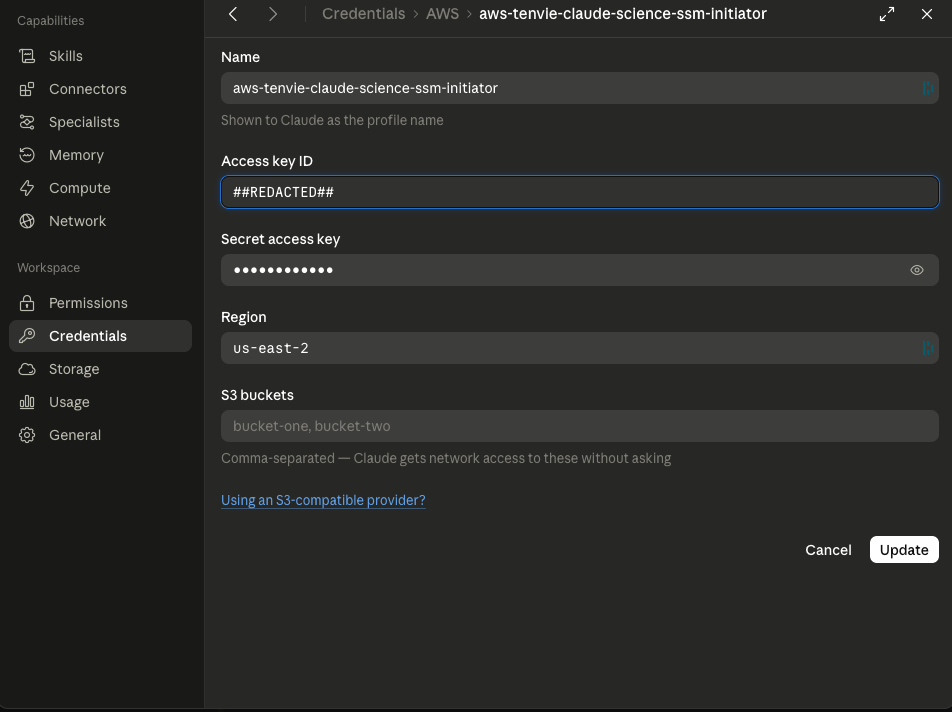
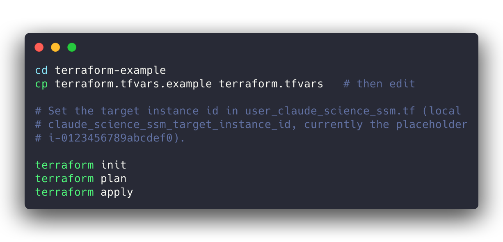
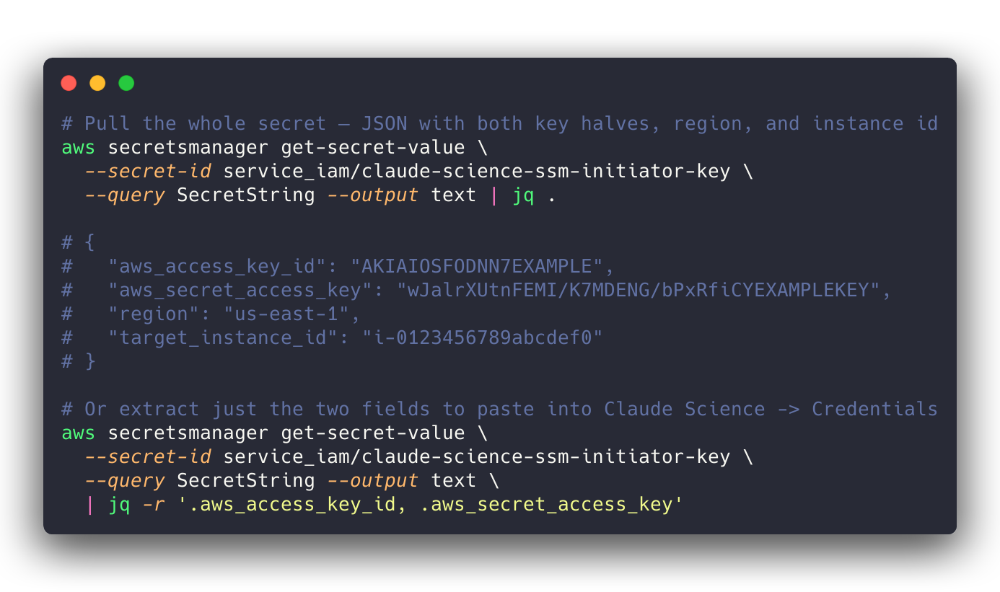
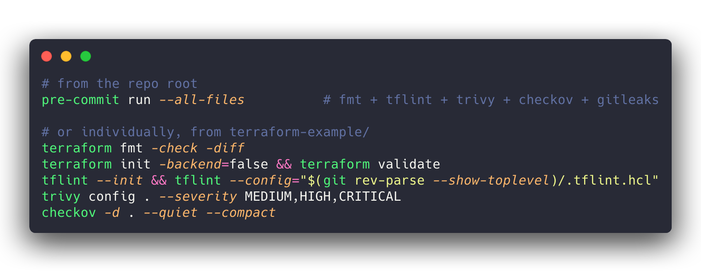

# IAM user for Claude Science via AWS SSM sessions

## What
Provisions a least-privilege IAM machine identity whose *only* capability is to
open an AWS Systems Manager (SSM) Session Manager session — SSH or
port-forwarding — to **one** specific EC2 instance. It exists for the
[`schrodinger-aws-hpc-ssm-connector`](../skills/schrodinger-aws-hpc-ssm-connector)
skill's "Credentials store" path, where a long-lived static access key is
unavoidable and the mitigation is blast radius, not expiry.

Read [`references/05-least-privilege-iam.md`](../skills/schrodinger-aws-hpc-ssm-connector/references/05-least-privilege-iam.md)
in that skill for the full design rationale.

## Why?

At the time this document was created, Claude Science only supports the use of long-lived static
credentials when connecting to AWS. This is not a very safe practice in 2026 so we wanted to
document how to make IAM credentials that can be connected to Claude Science "As safe as possible" while
still holding out hope that future versions of Claude Science will support the more modern short-lived
STS vended and AWS SSO role-based access credentials. 

### Ugh


## Two ways to create it

The same user and the same policy, two ways to build them — pick whichever fits
how you work:

| Path | Use when | Start here |
|---|---|---|
| **Terraform** | You manage infrastructure as code. Less error-prone, and pins the policy set against drift. | [`terraform-example/`](terraform-example/) → [Using the Terraform example](#using-the-terraform-example) below. |
| **Manual (console)** | You have console access but don't use Terraform. | [`manual-example/README.md`](manual-example/README.md) — click-by-click, with the real JSON policy to paste in. |

Both produce an identical `claude-science-ssm-initiator` user and the identical
three-statement policy, so **the security model and warnings below apply equally
to both.** The only difference is drift protection: Terraform pins the attached
policy set automatically; in the console that becomes a manual discipline (the
`manual-example` README calls this out).

## Why this is safe despite a long-lived key

The Claude Science Credentials store has no SSO/STS path, so a static IAM
access-key pair is mandatory. This example shrinks what that key can do to almost
nothing:

- **One instance, three documents.** `ssm:StartSession` authorizes against both
  the target *instance* ARN and the session *document* ARN. The policy allows
  exactly one instance and exactly three AWS-managed documents
  (`AWS-StartSSHSession`, `AWS-StartPortForwardingSession`,
  `AWS-StartPortForwardingSessionToRemoteHost`).
- **`ssm:SessionDocumentAccessCheck = true`** — the single most important line.
  Without it, holding `StartSession` implicitly grants the root-capable
  `SSM-SessionManagerRunShell` document, bypassing the allow-list.
- **Own-session scoping.** Messaging channels and `TerminateSession`/`ResumeSession`
  are scoped to `session/${aws:username}-*`.
- **Pinned attachments.** `aws_iam_user_policy_attachments_exclusive` prevents an
  out-of-band console attachment from silently widening the grant.

A stolen key gets an attacker a transport tunnel to one host — and reaching a
shell still requires the separate SSH private key.

## The controls in detail

Every permission and control the setup creates, what it is, why it's there, and
what it protects. This applies to **both paths** — the Terraform and the manual
JSON policy produce the same grant. The IAM policy grants **only** what is listed
under "Permissions granted" — everything else (S3, STS/`AssumeRole`, other EC2,
every non-SSM API) is denied by default because IAM denies anything not
explicitly allowed.

### Permissions granted

The policy has exactly three `Allow` statements — and there is no fourth. In
Terraform it is `data.aws_iam_policy_document.claude_science_ssm_start_session`;
in the console it is
[`manual-example/claude-science-ssm-start-session-policy.json`](manual-example/claude-science-ssm-start-session-policy.json),
whose `Sid`s match the statement names below one-for-one.

**1. Start a session — but only to one instance, with three documents**
(sid `StartSessionOnTargetInstanceWithAllowedDocuments`)

- **Grants:** `ssm:StartSession`.
- **Scoped to:** two kinds of resource ARN at once — the single target EC2
  instance (`arn:aws:ec2:<region>:<account>:instance/i-0123456789abcdef0`) **and**
  exactly three AWS-managed session documents: `AWS-StartSSHSession`,
  `AWS-StartPortForwardingSession`, `AWS-StartPortForwardingSessionToRemoteHost`.
- **Why:** `ssm:StartSession` authorizes against the instance *and* the session
  document simultaneously. Listing one instance ARN and a three-document
  allow-list is what makes the grant "SSH/port-forward to this one host" instead
  of "SSM to anything."
- **Protects against:** lateral movement to any other instance, and use of any
  session document other than SSH / port-forwarding (e.g. an interactive shell
  document). Both the *where* and the *how* are pinned.

**1a. `ssm:SessionDocumentAccessCheck = true`** (a `BoolIfExists` condition on
statement 1)

- **Grants:** nothing — it *tightens* statement 1.
- **Why:** this is the single most important line in the policy. Without it,
  merely holding `ssm:StartSession` implicitly grants the default
  `SSM-SessionManagerRunShell` document — a **root-capable interactive shell** —
  which sails straight past the document allow-list above. The condition forces
  AWS to honour the allow-list.
- **Protects against:** silent privilege escalation from "SSH-only tunnel" to
  "root shell on the box." Omit this one line and every other control on this
  page is moot.

**2. Open the session's data path — but only for its own sessions**
(sid `OwnSessionMessageChannels`)

- **Grants:** `ssmmessages:CreateControlChannel`, `CreateDataChannel`,
  `OpenControlChannel`, `OpenDataChannel`.
- **Scoped to:** `arn:aws:ssm:<region>:<account>:session/${aws:username}-*`.
- **Why:** these are the WebSocket control/data channels that actually carry the
  interactive and port-forwarding traffic; `StartSession` is useless without
  them. Scoping to `${aws:username}-*` limits them to sessions this principal
  opened (a non-federated IAM user's session id is `<username>-<random>`).
- **Protects against:** attaching to or snooping on sessions opened by other
  principals. Note the variable is **`aws:username`**, not `aws:userid` — the
  latter is for federated / assumed-role principals and would not match here.

**3. Tear down or resume — but only its own sessions**
(sid `ManageOwnSessions`)

- **Grants:** `ssm:TerminateSession`, `ssm:ResumeSession`.
- **Scoped to:** the same `session/${aws:username}-*` ARN as statement 2.
- **Why:** lets the principal cleanly end or resume the sessions it started.
- **Protects against:** terminating or hijacking *other* users' live sessions —
  a denial-of-service / session-takeover vector if left unscoped.

### Structural controls

Controls that come from *how* the resources are shaped, not from policy actions.

**4. A dedicated machine identity with no interactive access**
(`aws_iam_user.claude_science_ssm`, `path = "/service/"`)

- **What:** a purpose-built IAM user under the `/service/` path, with **no console
  login profile** and no password.
- **Why:** the credential is used only programmatically by the SSM `ProxyCommand`.
- **Protects against:** interactive console sign-in with this identity, and mixing
  this machine grant into a human's account. The `/service/` path also makes it
  easy to target service principals in higher-level SCPs or audits.

**5. The policy is attached to this user and nothing else**
(`aws_iam_user_policy_attachment.claude_science_ssm_start_session`)

- **What:** the least-privilege policy is bound to exactly this one user.
- **Why:** keeps the blast radius of the policy to the single machine identity.
- **Protects against:** the grant leaking onto other principals via a shared group
  or role.

**6. The attached-policy set is pinned (no drift)**
(`aws_iam_user_policy_attachments_exclusive.claude_science_ssm`)

- **What:** declares the *complete* set of managed policies on the user — just the
  one SSM policy. Terraform will remove anything else it finds attached.
- **Why:** belt-and-braces against out-of-band changes.
- **Protects against:** someone quietly attaching `AdministratorAccess` (or any
  other policy) to this user in the console later; Terraform reverts it on the
  next apply.

**7. The credential lives in Secrets Manager, never in plan output**
(`aws_secretsmanager_secret[_version].claude_science_ssm_key`)

- **What:** Terraform writes the access-key pair straight into an encrypted
  Secrets Manager secret and never exposes it as a Terraform `output`.
- **Why:** a long-lived key must be stored *somewhere*; an encrypted secret with
  its own access controls is the right place.
- **Protects against:** the secret half leaking into `terraform apply` console
  output, CI logs, or shell history. (It does still land in Terraform *state* —
  keep state in an encrypted, access-controlled backend; see below.)

### What still gates access even with the key

The IAM key is deliberately *not* sufficient on its own:

- **SSH host key.** The SSM session is only a transport tunnel; the `ProxyCommand`
  then opens an SSH connection *through* it, which requires the separate SSH
  private key. A stolen IAM key alone yields a tunnel to one host, not a shell.
- **Terraform state.** The secret access key is present in state, so the S3 (or
  other) state backend must be encrypted and access-controlled. `*.tfstate*` is
  gitignored so it can never be committed here.
- **Retrieval permission.** Reading the secret needs `secretsmanager:GetSecretValue`
  (and `kms:Decrypt` if you move to a CMK) — held by the credential administrator,
  not by the `claude-science-ssm-initiator` user itself.

### At a glance

| Control | Mechanism | Protects against |
|---|---|---|
| One instance only | Instance ARN in statement 1 | Lateral movement to other hosts |
| Three documents only | Document ARN allow-list in statement 1 | Use of arbitrary/shell session documents |
| `SessionDocumentAccessCheck` | `BoolIfExists` condition | Implicit root-shell (`RunShell`) escalation |
| Own-session channels | `${aws:username}-*` on `ssmmessages:*` | Snooping on other principals' sessions |
| Own-session lifecycle | `${aws:username}-*` on Terminate/Resume | Killing/hijacking others' sessions |
| No console login | User with no login profile | Interactive sign-in as this identity |
| Exclusive attachments | `..._policy_attachments_exclusive` | Out-of-band privilege widening |
| Secret in Secrets Manager | `aws_secretsmanager_secret*` | Key leaking into plan output / logs |
| Default-deny everything else | IAM implicit deny | S3, STS, other APIs, other EC2 |

The last two rows above are automatic in the Terraform path. In the manual path
they become your responsibility: don't attach any other policy to the user, and
store the key in Secrets Manager (or your credential manager) rather than in a
file — both are spelled out in [`manual-example/README.md`](manual-example/README.md).

## ⚠️ Warning — least-privilege is not no-privilege

> **These are real credentials to an internal host. Never share them, never
> publish them, never handle them insecurely — treat them exactly as you would a
> production SSH key or root password.**

Everything above shrinks the blast radius as far as a static, long-lived key
*can* be shrunk. It does **not** make a leaked key harmless. Be clear-eyed about
what an attacker who obtains this credential can do:

- **Reach a shell on an internal EC2 host.** The intended, sanctioned use of this
  key *is* to open an SSH session (via SSM) to a login node that is otherwise not
  internet-reachable. A shell also requires the SSH private key — but that key is
  typically handled alongside this credential, and anyone who compromises one
  handling channel (a laptop, a secrets store, a chat log) often gets both. Assume
  that a leak of this key can become a shell.
- **Move laterally.** From that login node an attacker is *inside* the network
  perimeter: they can reach other cluster nodes, internal services, shared
  filesystems, and management interfaces that trust traffic originating on the
  host — none of which the IAM policy has any say over.
- **Escalate locally.** With interactive access they can hunt for local
  privilege-escalation paths (kernel/sudo/SUID bugs, misconfigurations, cached
  credentials) to become root on the host, then pivot further.
- **Tunnel even without the SSH key.** The two port-forwarding documents let the
  key open a network tunnel to the host and forward to internal ports —
  reconnaissance and reachability of internal services that need no shell at all.

In other words: the IAM policy contains the *AWS-API* blast radius (no S3, no
`AssumeRole`, no other instances), but a shell on an internal host is a foothold
inside your network, and no IAM policy can constrain what happens after that.

**This is as safe as a mandatory static key can be made — but the remaining
responsibility is yours:**

- **Never commit or publish it** — not to git, gists, tickets, wikis,
  screenshots, or chat. (Secret scanning via `gitleaks` runs in pre-commit as a
  backstop, not a substitute for care.)
- **Never store it in plaintext** — it belongs in Secrets Manager / your
  credential manager, not a dotfile, `.env`, or note.
- **Never share it** between people or reuse it across systems. It is a single
  machine identity.
- **Guard the SSH private key with equal care** — the two together are what yield
  a shell.
- **Rotate immediately on any suspicion of exposure**
  (`terraform apply -replace=aws_iam_access_key.claude_science_ssm`), and rotate
  on a schedule regardless.

## Layout

| Path | Purpose |
|------|---------|
| `terraform-example/README.md` | Quickstart + file index for the Terraform path. |
| `terraform-example/user_claude_science_ssm.tf` | The IAM user, static key, Secrets Manager storage, and the three-statement least-privilege policy. |
| `terraform-example/variables.tf` | Caller-supplied inputs (`aws_region`, `account_name`, `region_short_name`). |
| `terraform-example/providers.tf` | AWS provider + `aws_caller_identity` lookup (drop if your repo already configures these). |
| `terraform-example/versions.tf` | Terraform + provider version constraints. |
| `terraform-example/terraform.tfvars.example` | Copy to `terraform.tfvars` (gitignored) and edit. |
| `manual-example/README.md` | **No Terraform?** Click-by-click console walkthrough to create the same user by hand. |
| `manual-example/claude-science-ssm-start-session-policy.json` | The real least-privilege policy to paste into the console (replace the `<…>` placeholders). |
| `assets/` | Rendered images used by this README. |

## Using the Terraform example

> Prefer the console? Skip this section and follow
> [`manual-example/README.md`](manual-example/README.md) instead.

This is an **example**, not a deployable module — copy the files into your own
infra repo and adapt them.



## How the access key gets into Secrets Manager

> This section (and the two that follow) describe the **Terraform** path. The
> console equivalents live in [`manual-example/README.md`](manual-example/README.md).

The credential is generated by Terraform and stored in AWS Secrets Manager on
apply — it is **never** printed to the console, written to a `.tfvars` file, or
exposed as a Terraform output. Three resources in `user_claude_science_ssm.tf`
do the work:

1. **`aws_iam_access_key.claude_science_ssm`** — AWS mints the static key pair for
   the IAM user. The secret half of an access key is only ever returned by AWS at
   creation time, so Terraform captures it here and hands it straight to the next
   resource. (It does land in Terraform *state*, so keep state in an encrypted,
   access-controlled backend — S3 + SSE, never a local file in this repo. Note
   `*.tfstate*` is gitignored.)

2. **`aws_secretsmanager_secret.claude_science_ssm_key`** — creates the secret
   *container*. Its name is derived from the username:

   ```
   service_iam/claude-science-ssm-initiator-key
   ```

   The example encrypts it with the default `aws/secretsmanager` KMS key; supply
   `kms_key_id` (a CMK) here for production.

3. **`aws_secretsmanager_secret_version.claude_science_ssm_key`** — writes the
   actual value. Both halves of the credential are packed into **one JSON secret**
   (alongside the region and target instance id) via `jsonencode`, so the operator
   retrieves everything needed from a single place:

   ```json
   {
     "aws_access_key_id":     "AKIA…",
     "aws_secret_access_key": "…",
     "region":                "us-east-1",
     "target_instance_id":    "i-0123456789abcdef0"
   }
   ```

Because the secret string is only ever written *into* the encrypted secret (never
read back into an `output`), the key material never appears in `terraform plan` /
`apply` console output.

## Retrieving the key pair

Whoever administers credentials pulls the secret with the AWS CLI (or the console:
**Secrets Manager → `service_iam/claude-science-ssm-initiator-key` → Retrieve
secret value**), then pastes the two credential fields into **Claude Science →
Customize → Credentials → Add Credential → AWS**. That is the credential the SSM
`ProxyCommand` uses — see
[`01-setup-ssm-ssh.md`](../skills/schrodinger-aws-hpc-ssm-connector/references/01-setup-ssm-ssh.md).



Retrieving the secret requires `secretsmanager:GetSecretValue` on that secret
(and `kms:Decrypt` on its key if you switch to a CMK) — a permission held by the
credential administrator, **not** granted to the `claude-science-ssm-initiator`
user itself.

### Rotation

Rotate by replacing the access key, which mints a fresh pair and overwrites the
secret value in place:

```bash
terraform apply -replace=aws_iam_access_key.claude_science_ssm
```

(On older Terraform this was `terraform taint aws_iam_access_key.claude_science_ssm`
followed by `terraform apply`.)

Then re-retrieve the secret and update the stored credential in Claude Science.
Because the key can do so little, rotation is low-stakes — but a schedule is still
good hygiene.

## Linting and security scanning

Terraform in this repo is formatted, linted, and statically scanned. The example
is kept **clean** against all of the tools below; the few intentional findings
(direct user attachment, static key, default KMS key, manual rotation) are
documented as inline `#tfsec:ignore` / `#checkov:skip` suppressions with a
rationale in `user_claude_science_ssm.tf`.

Run everything the same way CI does:



Config lives at the repo root: [`.tflint.hcl`](../.tflint.hcl),
[`.pre-commit-config.yaml`](../.pre-commit-config.yaml), and the CI workflow
[`.github/workflows/terraform.yml`](../.github/workflows/terraform.yml).

## Not for commit

This is a public repo. The example carries only placeholders — a dummy instance
id (`i-0123456789abcdef0`) and `example.internal` hostnames. Never replace them
with real instance ids, account ids, ARNs, or internal hostnames before
committing. See the repo [`CONTRIBUTING.md`](../CONTRIBUTING.md).
