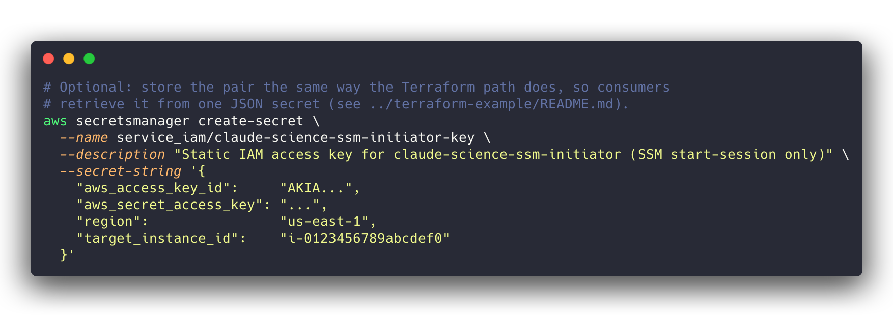
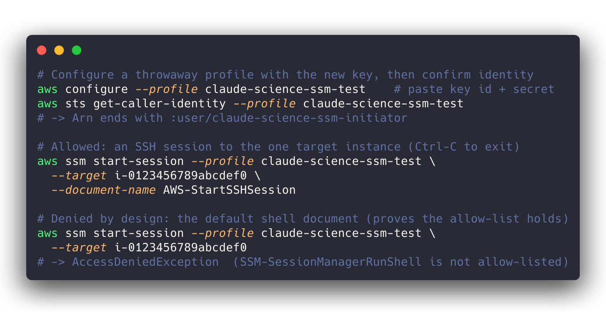

# Manual (console) setup — no Terraform required

This folder is for people who have **AWS Management Console access but do not use
Terraform**. It reproduces, by hand, exactly what the
[`../terraform-example`](../terraform-example) provisions: a dedicated,
least-privilege IAM user whose only capability is to open an SSM SSH /
port-forwarding session to **one** EC2 instance.

If you *do* use Terraform, use that folder instead — it is less error-prone and
pins the policy set against drift. This manual path is the fallback.

> ⚠️ **Read the security warning first.** These are real credentials to an
> internal host. Understand the risks and handling rules in the main
> [`../README.md`](../README.md#️-warning--least-privilege-is-not-no-privilege)
> before you create a key. Least-privilege is not no-privilege.

## What you will create

Four things, in order:

1. A **customer-managed IAM policy** — the three-statement least-privilege policy
   ([`claude-science-ssm-start-session-policy.json`](claude-science-ssm-start-session-policy.json) in this folder).
2. An **IAM user** — `claude-science-ssm-initiator`, **programmatic access only**
   (no console password).
3. The **policy attached** to that user — and nothing else.
4. An **access key** for the user, stored securely.

## Before you start — gather three values

You will substitute these into the policy:

| Placeholder | What it is | Example |
|---|---|---|
| `<ACCOUNT_ID>` | The 12-digit AWS account number (top-right of the console). | `123456789012` |
| `<REGION>` | The region hosting the target instance. | `us-east-1` |
| `<INSTANCE_ID>` | The EC2 instance id of the login/head node to allow. | `i-0123456789abcdef0` |

The target instance must be a **managed node** — the SSM Agent running and an
instance profile granting `AmazonSSMManagedInstanceCore` — or no session can be
started regardless of this policy. ParallelCluster head nodes usually satisfy
this already.

## The policy, and why each line is there

The file [`claude-science-ssm-start-session-policy.json`](claude-science-ssm-start-session-policy.json)
is the real policy — three `Allow` statements and nothing else. For a line-by-line
explanation of what each grant protects, see
[**The controls in detail**](../README.md#the-controls-in-detail) in the main
README. The essentials:

- **Statement 1** allows `ssm:StartSession` against the single instance ARN **and**
  only three AWS-managed session documents (`AWS-StartSSHSession`,
  `AWS-StartPortForwardingSession`, `AWS-StartPortForwardingSessionToRemoteHost`).
  The `ssm:SessionDocumentAccessCheck = true` condition is **mandatory** — without
  it, holding `StartSession` implicitly grants the root-capable
  `SSM-SessionManagerRunShell` document and the allow-list is bypassed.
- **Statements 2 and 3** allow the WebSocket data channels and session
  terminate/resume, scoped to the user's *own* sessions.

Two substitution rules that will bite you if you get them wrong:

- **The session-document ARNs have an EMPTY account-id field**
  (`arn:aws:ssm:<REGION>::document/AWS-...` — note the `::`). These documents are
  AWS-owned. If you paste your account id in there, the ARN will not match and
  `StartSession` is denied. Replace only `<REGION>`.
- **`${aws:username}` is a policy variable — leave it exactly as written.** Do
  **not** replace it with the user name. AWS fills it in at request time; an IAM
  user's session id is `<username>-<random>`, so this scopes the channel/lifecycle
  actions to this user's own sessions. (AWS's generic samples use `${aws:userid}`;
  that form is for assumed-role / federated principals, not a plain IAM user like
  this one — do not copy it here.)

## Step-by-step in the console

### Step 1 — Create the customer-managed policy

1. Open the **IAM console** → **Policies** → **Create policy**.
2. Select the **JSON** tab and paste the contents of
   [`claude-science-ssm-start-session-policy.json`](claude-science-ssm-start-session-policy.json).
3. Replace `<ACCOUNT_ID>`, `<REGION>`, and `<INSTANCE_ID>` with your values from
   the table above. **Leave `${aws:username}` and the empty `::` in the document
   ARNs untouched.**
4. Click **Next**. Name the policy `claude-science-ssm-start-session` and give it
   the description *"Allow claude-science to start SSM SSH/port-forward sessions to
   exactly one instance."*
5. **Create policy.**

### Step 2 — Create the IAM user

1. IAM console → **Users** → **Create user**.
2. User name: `claude-science-ssm-initiator`.
3. **Do NOT** check *"Provide user access to the AWS Management Console."* This is a
   machine identity — it must have no console password.
4. Click **Next**.

### Step 3 — Attach the policy (and only this policy)

1. On the permissions page choose **Attach policies directly**.
2. Search for `claude-science-ssm-start-session` and check it.
3. Confirm **no other policies** are selected. This user must carry this one policy
   and nothing else.
4. **Next** → **Create user**.

> The Terraform path enforces "exactly one policy, forever" with
> `aws_iam_user_policy_attachments_exclusive`. The console has no equivalent, so
> **this is now a manual discipline**: never attach another policy to this user,
> and audit it periodically.

### Step 4 — Create an access key

1. Open the new user → **Security credentials** tab → **Create access key**.
2. Use case: choose **Third-party service** (or **Command Line Interface (CLI)**);
   either is fine for a programmatic key. Acknowledge the recommendation warning
   and continue.
3. **Copy the Secret access key now** — AWS shows the secret **only once**.
   Download the `.csv` or copy both the *Access key ID* and *Secret access key*
   immediately.

### Step 5 — Store the key securely

Put the pair where it belongs and nowhere else:

- **Directly into Claude Science** → Customize → Credentials → Add Credential →
  AWS, pasting the access key id and secret. This is the end goal.
- **Or into Secrets Manager**, to mirror the Terraform layout (one JSON secret the
  consumer reads from a single place). Either use **Secrets Manager → Store a new
  secret → Other type of secret → Plaintext** and paste the JSON below, or run:

Never paste the secret into a file in this repo, a ticket, a chat message, or a
screenshot. See the [handling rules](../README.md#️-warning--least-privilege-is-not-no-privilege).

## Verify it works (and that the guardrails hold)

Confirm both that the key can do its one job **and** that it cannot open a root
shell:

The second `start-session` (no `--document-name`) must fail with
`AccessDeniedException` — that is the `SessionDocumentAccessCheck` condition doing
its job. If it instead drops you into a shell, the condition is missing from your
policy; go back and fix Statement 1. Delete the throwaway test profile when done.

The full SSH-through-SSM `ProxyCommand` wiring (host config, SSH key) is covered in
[`01-setup-ssm-ssh.md`](../../skills/schrodinger-aws-hpc-ssm-connector/references/01-setup-ssm-ssh.md).

## Rotation

The console equivalent of the Terraform "replace the key" step:

1. User → **Security credentials** → **Create access key** (a second, new key).
2. Update the stored credential (Claude Science / Secrets Manager) to the new pair.
3. Confirm the new key works, then **deactivate** the old key, and once you're sure
   nothing broke, **delete** it.

Rotate on any suspicion of exposure, and on a schedule regardless.

## Files here

| File | Purpose |
|---|---|
| `claude-science-ssm-start-session-policy.json` | The real least-privilege policy to paste in Step 1 (replace the `<…>` placeholders). |
| `assets/` | Rendered CLI images used by this README. |
