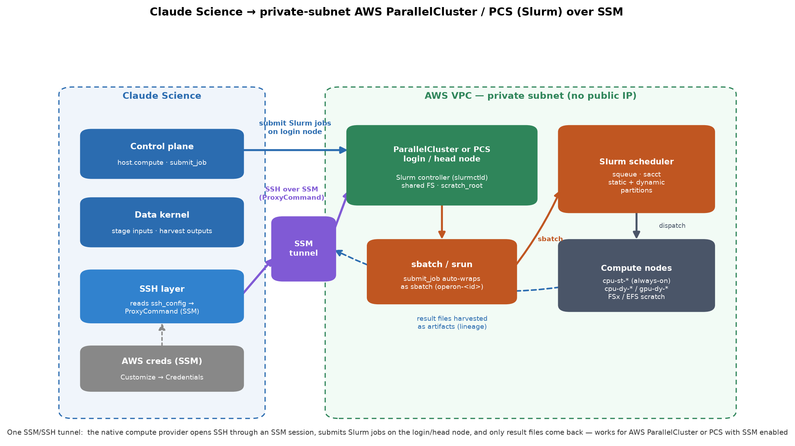

# aws-hpc-slurm-ssm-connector

A Claude Science skill: connect Claude Science to a **private-subnet AWS HPC
cluster** — an **AWS ParallelCluster** or **AWS PCS** (Parallel Computing Service)
running **Slurm**, or any Slurm head/login node — whose only ingress is **AWS
Systems Manager (SSM)**, then submit, monitor, and harvest Slurm jobs from it.

**Works for AWS ParallelCluster or AWS PCS** — the method is the same as long as
SSM access is enabled to the login/head node (SSM Agent running + the instance
role allows Session Manager). PCS-managed clusters have this on their login nodes
by default. (Verified end-to-end on ParallelCluster; PCS uses the same design.)

This is a field-verified playbook — built and confirmed end-to-end against a
live AWS ParallelCluster (Slurm 23.11.10; cluster access courtesy of Tenvie) —
so the failure modes and fixes here are the ones that actually bite. It is the
transport-only sibling of
[`schrodinger-aws-hpc-ssm-connector`](../schrodinger-aws-hpc-ssm-connector):
same SSM→SSH reduction, no Schrödinger/jobserver layer — just plain Slurm.



## The one idea

Claude Science's native compute provider speaks **SSH**, not SSM. The whole
integration is: **reduce the SSM channel to an ordinary SSH connection** with an
`aws ssm start-session` `ProxyCommand` in `ssh_config`, register the head node
as an SSH compute provider, and submit Slurm jobs through it.

```
Claude Science ──SSH──▶ [ ProxyCommand: aws ssm start-session ] ──SSM──▶ head / login node
                                                                            │
                                                                    sbatch  │
                                                                            ▼
                                                                    Slurm ──▶ compute nodes
```

## What's in here

| File | What it covers |
|---|---|
| `SKILL.md` | Entry point + the hard-won lessons (read this first) |
| `references/architecture.md` | Mental model: the SSM→SSH reduction and the Slurm layer |
| `references/01-setup-ssm-ssh.md` | The `ssh_config` entry (with the verified PATH fix), least-privilege IAM, provider registration, smoke test |
| `references/02-secrets-and-credentials.md` | The two secret types (AWS creds for SSM, the SSH key) and the static-key constraint of the Credentials store |
| `references/03-run-and-test.md` | Plain-Slurm validation: `call_command` vs `submit_job`, the `scratch_root` requirement, `squeue`/`sacct` monitoring, harvesting |
| `references/04-troubleshooting.md` | Symptom→cause→fix: SSM/ProxyCommand/PATH failures, IAM denials, ports, failed-job diagnosis |
| `references/05-least-privilege-iam.md` | The design rationale for a dedicated IAM user that can *only* start an SSM session to one instance |
| `templates/ssh_config.template` | Fill-in-the-blanks `ssh_config` with the SSM `ProxyCommand` |
| `assets/user_claude_science_ssm.tf` | Sanitized least-privilege IAM Terraform plan (the ready-to-run version + a no-Terraform console path live in [`iam-user-for-ssm-sessions/`](../../iam-user-for-ssm-sessions/)) |
| `assets/make_architecture_diagram.py` | Regenerates the architecture PNG (matplotlib) |
| `assets/captures/` | Verified raw terminal output (smoke test, `sbatch`/`squeue`/`sacct`, `submit_job` round-trip) — feed these to a code-image renderer for docs/slides |

## Using it in Claude Science

Point your Claude Science skill source at this directory (or the repo), then load
it with `skill({skill: "aws-hpc-slurm-ssm-connector"})`. The skill triggers on SSM /
Session Manager / private-subnet / ParallelCluster / Slurm-over-SSM vocabulary
and on the `Connection closed by UNKNOWN port 65535` failure signature.

## The hard-won lessons (summary)

1. **The `ProxyCommand` fails silently on a macOS desktop app — it's PATH.**
   Symptom `Connection closed by UNKNOWN port 65535`, identical with and without
   `--profile`. Prepend `PATH=` inside the ProxyCommand so it finds both `aws`
   and the `session-manager-plugin` it calls by name.
2. **`--profile` vs. injected creds depends on where the connection opens** —
   required on a desktop install (reads `~/.aws/credentials`).
3. **Provider needs a `scratch_root`** on a shared filesystem before
   `submit_job` works.
4. **`call_command` runs on the login node; `submit_job` auto-wraps as `sbatch`**
   (job name `operon-<id>`) so the script body runs on a compute node.
5. **`submit_job` does not take `login_shell=`** — put `module load` / `export`
   inside the job script.

## Verified end-to-end

Confirmed 2026-07-01 against a live AWS ParallelCluster (Slurm 23.11.10):
reachability smoke test, an explicit `sbatch` job tracked through
`squeue`→`sacct` (`COMPLETED`, exit `0:0`), and a `submit_job` round-trip that
staged, ran on a compute node, and harvested the result file back as an
artifact. Raw captures are in `assets/captures/` (identifiers sanitized;
cluster provided by Tenvie).

## Credentials & security

The AWS credential registered in Claude Science can be — and should be — a
**least-privilege IAM user** that can *only* open an SSM session to the one
login node. `references/05-least-privilege-iam.md` explains the design;
[`iam-user-for-ssm-sessions/`](../../iam-user-for-ssm-sessions/) at the repo root
is the ready-to-use build. All identifiers in this repo are placeholders or
sanitized; replace them with your own.

## License

MIT — see `LICENSE`.
