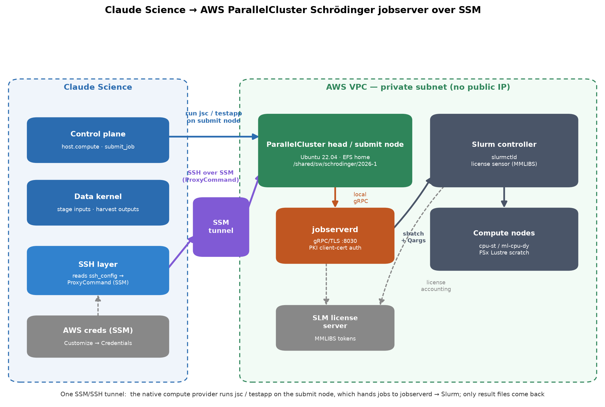

# schrodinger-aws-hpc-ssm-connector

A Claude Science skill: connect Claude Science to a **Schrödinger Suite
jobserver** running on an **AWS ParallelCluster** (or any Slurm HPC) whose
head/submit node is reachable **only through AWS Systems Manager (SSM)**, then
submit, monitor, harvest, and postmortem Schrödinger jobs from it.

This is a field-verified playbook — built and confirmed end-to-end against a
live cluster (Schrödinger 2026-1, `jobserverd` 73163 / API v1.19.4,
ParallelCluster + Slurm, SLM licensing) — so the failure modes and fixes here
are the ones that actually bite.

## The one idea

Claude Science's native compute provider speaks **SSH**, not SSM. The whole
integration is: **reduce the SSM channel to an ordinary SSH connection** with an
`aws ssm start-session` `ProxyCommand` in `ssh_config`, register the head node
as an SSH compute provider, and run `jsc`/`testapp` on it through the provider.

## What's in here

| File | What it covers |
|---|---|
| `SKILL.md` | Entry point + the hard-won lessons (read this first) |
| `references/architecture.md` | Mental model: the SSM→SSH reduction, the jobserver gRPC/PKI layer, the Slurm layer |
| `references/01-setup-ssm-ssh.md` | The `ssh_config` entry (with the verified PATH fix), least-privilege IAM, provider registration, smoke test |
| `references/02-secrets-and-credentials.md` | The three secret types and the static-key constraint of the Credentials store |
| `references/03-run-and-test.md` | `testapp` validation, how `-HOST` routes through the jobserver, the two-Slurm-layer trap, harvesting, and collecting a `jsc postmortem` |
| `references/04-troubleshooting.md` | Symptom→cause→fix: SSM/ProxyCommand failures, the weak-RSA/OpenSSL-3 cert failure, version-match, ports |
| `references/05-least-privilege-iam.md` | The design rationale for a dedicated IAM user that can *only* start an SSM session to one instance |
| `templates/ssh_config.template` | Fill-in-the-blanks `ssh_config` with the SSM `ProxyCommand` |
| `assets/user_claude_science_ssm.tf` | Sanitized least-privilege IAM Terraform plan (the ready-to-run version + a no-Terraform console path live in [`iam-user-for-ssm-sessions/`](../../iam-user-for-ssm-sessions/)) |
| `assets/make_architecture_diagram.py` | Regenerates the architecture PNG (matplotlib) |

## Using it in Claude Science

Point your Claude Science skill source at this directory (or the repo), then load
it with `skill({skill: "schrodinger-aws-hpc-ssm-connector"})`. The skill triggers
on Schrödinger / jobserver / `jsc` / `testapp` / SSM / ParallelCluster vocabulary.

## The hard-won lessons (summary)

1. **The `ProxyCommand` fails silently on a macOS desktop app — it's PATH.**
   Symptom `Connection closed by UNKNOWN port 65535`, identical with and without
   `--profile`. Prepend `PATH=` inside the ProxyCommand so it finds both `aws`
   and the `session-manager-plugin` it calls by name.
2. **`--profile` vs. injected creds depends on where the connection opens** —
   required on a desktop install (reads `~/.aws/credentials`).
3. **`-HOST` routes THROUGH the jobserver, not straight to Slurm** — the job
   shows in `jsc info`, not the login node's `squeue`.
4. **The two-Slurm-layer trap** — the jobserver's Slurm cluster is invisible to
   the login node's `squeue`; a provider `sbatch` wrapper can add a second job.
5. **Trust `jsc info`, not the wrapper exit code.**
6. **Provider needs a `scratch_root`** before `submit_job` works.
7. **Schrödinger may not be a module** — `export SCHRODINGER=/shared/sw/schrodinger/<release>`.

## Credentials & security

The AWS credential registered in Claude Science can be — and should be — a
**least-privilege IAM user** that can *only* open an SSM session to the one
login node. `references/05-least-privilege-iam.md` explains the design;
[`iam-user-for-ssm-sessions/`](../../iam-user-for-ssm-sessions/) at the repo root
is the ready-to-use build, with a full security write-up, a **Terraform** example,
and a **no-Terraform console walkthrough** (with the real JSON policy). Read its
[⚠️ credential-handling warning](../../iam-user-for-ssm-sessions/README.md#️-warning--least-privilege-is-not-no-privilege)
before you create a key: least-privilege is not no-privilege, and a leaked key is
a foothold on an internal host. All identifiers in this repo are placeholders;
replace them with your own.

## License

MIT — see `LICENSE`.
